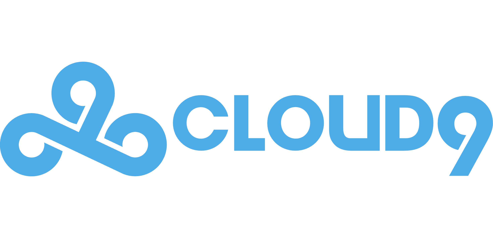

# Cloud9 Roster Moment

> **Become a Cloud9 pro! AI instantly turns your photo into a custom roster card to share and keep forever.**



## 📖 About The Project

**Cloud9 Roster Moment** is an interactive fan engagement experience designed for live esports events. It leverages state-of-the-art Generative AI to seamlessly integrate fans into the Cloud9 professional roster.

Fans simply upload a photo or take a selfie, and within seconds, they receive a high-quality, branded poster featuring themselves alongside 5 current Cloud9 pro players.

### Key Features

*   **📸 AI Roster Generation:** Uses Google Gemini 1.5 Pro to blend user photos with professional player assets while preserving identity and art style.
*   **📧 Instant Delivery:** Automates email delivery of the generated poster (via Brevo API) for easy social sharing.
*   **📊 Live Event Dashboard:** Real-time analytics for organizers to track engagement (posters generated, favorite players, role distribution).
*   **🖼️ Public Gallery Mode:** A dedicated "TV Mode" that auto-refreshes to display the latest generated rosters on large screens at the booth.
*   **🛡️ Robust Architecture:** Built to handle live event constraints with local SQLite buffering and reliable API integrations.

---

## 🛠️ Technology Stack

*   **AI:** Google Gemini 1.5 Pro (Vertex AI / Studio SDK) - *Multimodal image generation & blending*
*   **Frontend:** Vanilla JavaScript, HTML5, CSS3 - *Mobile-first SPA*
*   **Backend:** Node.js, Express - *API orchestration & file management*
*   **Database:** SQLite (better-sqlite3) - *Local data persistence & gallery management*
*   **Services:** Brevo (Email API) - *Transactional email delivery*

---

## 🚀 Installation & Setup

This project is a monorepo containing both the Frontend (Vite) and Backend (Node.js).

### Prerequisites
*   Node.js (v18 or higher)
*   Google AI Studio API Key
*   Brevo API Key (for emails)

### 1. Clone the Repository
```bash
git clone https://github.com/yourusername/cloud9-roster-moment.git
cd cloud9-roster-moment
```

### 2. Setup Backend
The backend handles the AI generation and database.

```bash
cd server
npm install
```

Create a `.env` file in the `server` directory with the following variables:
```env
GOOGLE_API_KEY=your_gemini_api_key
SMTP_PASS=your_brevo_api_key
EMAIL_FROM=no-reply@cloud9.gg
PORT=3001
```

Start the server:
```bash
npm start
```
The server will run on `http://localhost:3001`.

### 3. Setup Frontend
Open a new terminal window in the project root.

```bash
npm install
npm run dev
```
The frontend will launch (usually at `http://localhost:5173`).

---

## 🎮 Usage Guide

1.  **Open the App:** Navigate to the frontend URL on your phone or browser.
2.  **Select Preferences:** Choose your Role (Top, Jungle, etc.) and Art Style (Painted Hype, Match Day).
3.  **Take Photo:** Upload a selfie.
4.  **Generate:** The app sends the request to the local backend.
5.  **View & Share:** 
    *   **User:** Receives email with the poster.
    *   **Gallery:** The image appears on `/gallery.html`.
    *   **Dashboard:** Stats update on `/dashboard`.

---

## 🏆 Hackathon Context

This project was built for the **Google Cloud Vertex AI Agent Builder Hackathon** (2025/2026). It demonstrates the power of multimodal AI in creating personalized, real-time brand experiences.

**Team:**
*   Jon Llaguno
*   Cloud9 Engineering Team (Simulated)

---

## 📄 License

Distributed under the MIT License. See `LICENSE` for more information.
